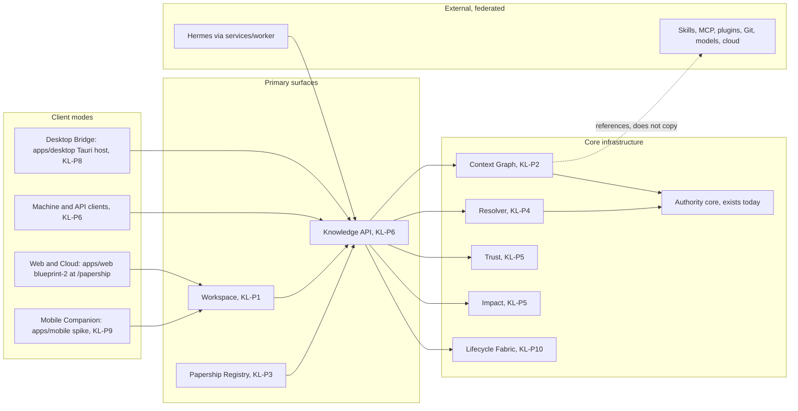

# Architecture

Papership is one platform, one knowledge network, and multiple interfaces. KL-P0 records the target shape and maps it onto the repository. It does not build the missing layers.

Companion documents: [boundaries](DOMAIN_BOUNDARIES.md), [concepts](CANONICAL_CONCEPTS.md), [clients](CLIENT_ARCHITECTURE.md), [audit](REPOSITORY_AUDIT.md). The running release-1 shape remains [docs/architecture.md](../architecture.md).

## Shape

## Core infrastructure

| Layer | Job | Exists today | Arrives |
|---|---|---|---|
| Context Graph | What agent-relevant knowledge and capabilities exist, and how they relate | Seeds: `memory_items`, loop artifacts, attachments, capability-registry rows, connections, source references | KL-P2 |
| Resolver | Given this task and agent, which knowledge should be acquired | Seeds: grant intersection, memory visibility | KL-P4 |
| Trust | Whether that knowledge should be trusted | Seeds: memory classes, pack trust verdicts, source-permission intersection, registry evidence | KL-P5 |
| Impact | Whether that knowledge helped or harmed | Seeds: usage events, receipts, job events, audit records | KL-P5 |
| Knowledge API | Machine-native access to the same state the Workspace shows | Today's FastAPI routes plus `packages/contracts` | KL-P6 |
| Lifecycle Fabric | Knowledge and configuration tracked across the agent pipeline | Seeds: jobs, runs, loop stages, schedules | KL-P10 |
| Authority | Who may read, change, or approve knowledge | Principals, grants, approvals, receipts, audit | Keep |

Commerce (KL-P11) is an optional layer on the Papership Registry. It is not required for the loop to function. Charges stay off (`ENGINE_BILLING_CHARGES_ENABLED=0`).

## Primary surfaces

| Surface | Role | Current home |
|---|---|---|
| Workspace | Human inspection and governance | `apps/web/src/blueprint2/` at `/papership` |
| Papership Registry | Discovery and supply of Agent Materials | Not built. Today's "Registry" screen is the 43-domain capability catalogue |
| API | Canonical state for every client | `services/api` (`create_app` in `app/main.py`) |

## Where the running system lives

| Path | Role in the Knowledge Layer |
|---|---|
| `apps/web` | Live Workspace. Hash navigation, blueprint-2 theme, overlay merge in `src/api/papership.js` |
| `apps/desktop/src-tauri` | Tauri 2 host. Loads `apps/web/dist`. Keychain commands. Future Desktop Bridge shell |
| `apps/desktop/src` | Earlier React shell. Not what Tauri ships. Deprecate later |
| `apps/mobile` | Config-only Tauri mobile spike. Same web dist. No Rust crate yet |
| `services/api` | Authority, ledger, memory, connections, usage. SQLite file store |
| `services/worker` | Hermes adapter and tool policy. The only component that should speak to Hermes |
| `packages/contracts` | TypeScript and Zod contracts. Not yet enforced by the Python API |
| `packages/ui` | Tokens and primitives consumed by the unused desktop `src` shell |
| `infra/compose` | Local stack: proxy, API, worker, Postgres, auth stub. The API still uses SQLite |
| `docs/policies` | Binding authority, memory, residency, erasure, and licensing rules |

## Dead-end guards

These are binding for later phases. Detail is in [DECISION_LOG.md](DECISION_LOG.md).

- Context versions are immutable. Trust, Impact, and Approval cite an exact version.
- Organisation is the ownership root. New code must not add hard-coded tenant, principal, or project literals.
- Knowledge entities use one typed persistence path so the store can move off SQLite without a rewrite.
- Runtimes and clients read and write knowledge only through the Knowledge API.
- Third-party context is untrusted until a human promotes it.
- Lower-authority material cannot silently override higher-authority policy.
- Impact events carry identifiers and enums, never model chain-of-thought or prompt text.
- Native ecosystem files stay canonical. Papership stores metadata and relationships.
