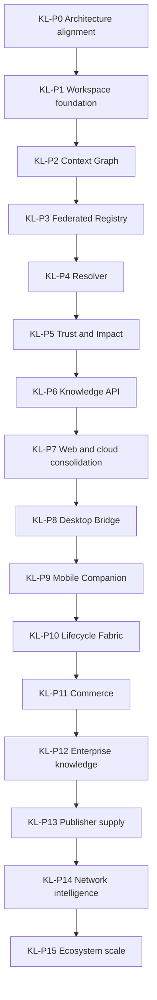

# Phase roadmap

Identifiers KL-P0 through KL-P15 are the Knowledge Layer. They are not the closed Company OS phases in `docs/roadmap.md`. Forward work follows this file. D-36 records the split.

Each phase leaves Papership usable. A phase may do small preparatory work from a later phase only when a dependency requires it. Low-level library and schema choices belong to the implementing phase, inside the guards in [DECISION_LOG.md](DECISION_LOG.md).

| Phase | Domain | Goal | Inherits | Exit | Guard |
|---|---|---|---|---|---|
| KL-P0 | Architecture alignment | Understand the repo and write the boundaries | Running Workspace, authority core, memory policy | Docs exist, product unchanged, readiness reported | No feature construction |
| KL-P1 | Human knowledge control plane | Reframe the Workspace around agent knowledge without deleting useful behaviour | blueprint-2 shell, memory route, approvals API, Hermes host probe | Agents and tasks can reference context later without a structural rewrite. UI still recognisable | No Registry, Resolver, Bridge, or mobile |
| KL-P2 | Universal knowledge model | One ContextObject abstraction over skills, tools, documents, memory, and policies | `memory_items`, artifacts, connections, registry rows | Different sources can be represented without replacing native files. Workspace can point at graph objects | KL-D1, KL-D3, KL-D5, KL-D8 |
| KL-P3 | Discovery and supply | Discover Agent Materials across Papership and external ecosystems | Pack manifests, capability catalogue (labelled separately), connectors | An operator or API can find candidates. Native sources stay canonical | KL-D9. Not a marketplace |
| KL-P4 | Resolver | Answer what knowledge this agent should acquire for this task | Grant intersection, memory visibility, graph | A ContextPlan exists for a task, or an explicit gap. Dispatch is non-blocking | KL-D4, KL-O1, KL-O2 closed or defaulted |
| KL-P5 | Trust and Impact | Decide trust and record whether context helped | Memory classes, pack verdicts, usage events, receipts, audit | Assessments and observations cite exact versions. No chain-of-thought | KL-D6, KL-D7 |
| KL-P6 | Machine-native access | External agents use Papership without the Workspace | Existing REST and contracts | Same canonical state as the Workspace, via a documented API | RULE: no second truth in clients |
| KL-P7 | Canonical human access | Workspace, Registry, and admin on the Papership domain | Web deploy, blueprint-2 | One web origin for human operation | `papership.com.au` is the intended domain. Marketing site stays separate. Owner action |
| KL-P8 | Local and private connectivity | Reach knowledge that must stay on the machine | Tauri host, keychain, web dist | Bridge resolves local sources under the same grants. Cloud store is not a silent copy | Company OS "No Phase 8" does not apply. See D-36 |
| KL-P9 | Human supervision | Asynchronous approve / reject of knowledge activity | Approval API, mobile spike | A phone can supervise. It cannot fork product logic | Store submission stays owner-gated |
| KL-P10 | Continuity across the pipeline | Track configuration from task through outcome | Jobs, runs, loop stages | Lifecycle events cite context versions. Underlying tools stay external | KL-O3 |
| KL-P11 | Optional economics | Publishers can attach economic models | Rate card, charges off, allowances | Economics metadata exists. Papership is still not primarily a marketplace. Charges stay off until a separate owner flip | Do not rebuild payment rails |
| KL-P12 | Private organisation context | Compose public knowledge with private organisational context | Scopes, grants, Bridge | Private context is usable and still higher-authority than downloaded packs | KL-D2, KL-D6 |
| KL-P13 | Supply quality | Seed examples of excellent Agent Materials | Registry | Contextbook-style examples exist. Standards of Skills and MCP are not reinvented | KL-D8 |
| KL-P14 | Empirical optimisation | Resolver learns from impact, inside policy | Impact evaluations | Rankings cite evidence. They cannot override the authority ladder | KL-D6, KL-D7 |
| KL-P15 | Ecosystem scale | Papership is a dependency other agent platforms can call | Knowledge API | External agents resolve knowledge through Papership without a private fork of the graph | Interoperability over lock-in |

## Cross-phase use cases (acceptance themes, not KL-P0 work)

Later phases are done only when these stories are possible. KL-P0 records them so phase plans do not drop them.

| Story | Needs |
|---|---|
| Coding agent in a local repository | Graph, Resolver, API, Desktop Bridge |
| Business agent under organisation policy | Graph, Trust, organisation scope, approvals |
| Autonomous knowledge acquisition | Registry, Resolver, Trust, approvals for consequential adds |
| Model or runtime migration | Context versions independent of one model vendor |
| Stale or conflicting knowledge | Versions, conflicts_with, freshness, operator review |
| Private local knowledge | Desktop Bridge, private scope, no default upload |
| Publisher | Registry, provenance, optional commerce metadata |

## Plans

| Phase | Plan file |
|---|---|
| KL-P0 | `docs/plans/knowledge-layer/phase_0_architecture_alignment_plan.md` (`complete_conditional`) |
| KL-P1 | `docs/plans/knowledge-layer/phase_1_workspace_foundation_plan.md` (`complete_conditional`) |
| KL-P2 | `docs/plans/knowledge-layer/phase_2_context_graph_plan.md` (`complete`; security PASS) |
| KL-P3 | `docs/plans/knowledge-layer/phase_3_federated_registry_plan.md` (`complete`; security PASS) |
| KL-P4 | `docs/plans/knowledge-layer/phase_4_context_plan_plan.md` (`complete`; security PASS) |
| KL-P5 | `docs/plans/knowledge-layer/phase_5_trust_impact_plan.md` (`complete`; security PASS) |
| KL-P6 | `docs/plans/knowledge-layer/phase_6_knowledge_api_plan.md` (`complete`; security PASS) |
| KL-P7 | `docs/plans/knowledge-layer/phase_7_web_consolidation_plan.md` (`complete_conditional`; security PASS; registrar DNS remains) |
| KL-P8 | `docs/plans/knowledge-layer/phase_8_desktop_bridge_plan.md` (`complete`; security PASS) |
| KL-P9 | `docs/plans/knowledge-layer/phase_9_mobile_companion_plan.md` (`complete`, security PASS) |
| KL-P10 | `docs/plans/knowledge-layer/phase_10_lifecycle_fabric_plan.md` (`complete`, security PASS) |
| KL-P11 | `docs/plans/knowledge-layer/phase_11_optional_economics_plan.md` (`implemented_pending_security`) |
| KL-P12 onward | Generated only after the previous phase is verified |

Company OS plans `docs/plans/phase_0_foundations_plan.md` through `phase_7_ecosystem_mobile_plan.md` are historical. Do not append Knowledge Layer tasks to them.
