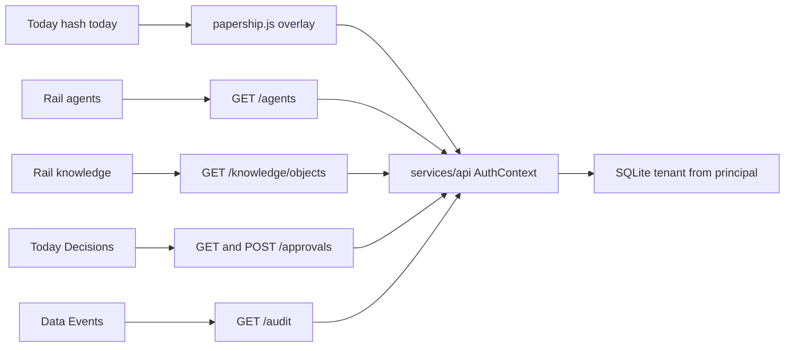

# Phase 1: Papership Workspace foundation

## 1. Objective

Reframe the live blueprint-2 Workspace from a company-operations dashboard into a human control plane for inspecting and governing agent knowledge. Keep useful Company OS behaviour. Leave nullable context references and an agent profile so KL-P2 can attach knowledge without a structural rewrite.

The owner asked for implementation on 2026-10-06. The Workspace foundation is in the tree. The phase is not done until the security review is recorded and is not BLOCKED.

## 2. Relation to project end-state

KL-P1 is the human surface. KL-P2 adds the Context Graph that these screens will point at. KL-P4 fills knowledge gaps and context plans. KL-P5 fills trust, impact, and cost. Until then those subsections stay honest empty states. The API remains the only source of truth. Desktop and mobile keep loading `apps/web/dist`. No second client truth.

## 3. Entry criteria and inherited evidence

- KL-P0 is `complete_conditional`. Security verdict is CONDITIONAL, not BLOCKED (`docs/workstreams/20261006-knowledge-layer/security-engineer-subagent/handoff.md`).
- D-36, KL-D1 through KL-D9, and the Workspace mapping in `docs/knowledge-layer/CLIENT_ARCHITECTURE.md` are binding.
- KL-SEC-01 and KL-SEC-02 are open code seams. This phase must not copy them into new tables or new retrieval.
- Live shell: `apps/web/src/blueprint2/App.jsx`. Hash tabs. `BOTTOM_TABS` is locked by `apps/web/tests/static-scan.test.mjs` to `today`, `work`, `inbox`.
- `POST /approvals` decides and inserts `status=approved`. There is no pending-approval list and no `GET /audit`.
- `principals.kind` already allows `agent`. There is no agent profile table. `memory_items` has version, parent, provenance, class, title, and content via `_migrate_phase5`.

## 4. Scope

- Nullable `context_plan_id` on agent profiles, work items, jobs, and runs. Nullable `context_refs` text on work items only, storing a JSON array of ids or NULL. No ContextPlan or ContextObject tables.
- `agent_profiles` rows tied to an existing agent principal. Organisation id is the caller's tenant from `AuthContext`.
- Read APIs: agents, knowledge objects (adapter over memory items and loop artifacts), approvals, audit.
- Blueprint-2 navigation and screens listed in section 9. Fixture decision counts and the fake Hey approval transcript stop being presented as live.
- Contracts in `packages/contracts` for the new response shapes.
- Tests for tenant scope, grant checks, and the static scan.
- Browser verification of the changed flows during implementation.

## 5. Non-goals

- No Papership Registry, marketplace, or catalogue rename. The 43-domain screen stays the capability catalogue (KL-D9).
- No Resolver, knowledge-gap detection, or automatic context attachment.
- No trust scores, impact scores, cost figures, or chain-of-thought.
- No Context Graph edges, versions beyond the memory `version` already stored, or content-addressed ids.
- No new grant class. No grant writes from Settings toggles.
- No `ENGINE_USAGE_EMIT` change. Reserved event names are not emitted.
- No Hermes write or external `accepted`. No Desktop Bridge, mobile crate, payments, or blueprint-3 chrome swap (KL-O6).
- No Postgres move (KL-O1). No replacement of the worker path-import or the store lock (KL-SEC-02). New knowledge reads must not run inside `run_engine_labs_stage_work`.
- No deletion of Work, Inbox, People, Integrations, the founder loop, plan, measurement, or erasure intent.

## 6. Current-state audit

See `docs/knowledge-layer/REPOSITORY_AUDIT.md`. KL-P1 uses these facts:

| Fact | Consequence for this phase |
|---|---|
| Tab keys are `today`, `work`, `inbox`, `people`, `data`, `files`, `integrations`, `settings` | Add `agents` and `knowledge` on the rail. Do not change `BOTTOM_TABS` |
| `loadPapershipOverlay` merges fixtures with live GETs | New panels read new endpoints. Do not paint fixture decisions, runs, or audit over an empty API result |
| `GET /memory` uses `memory_ops._visible_to`, which branches on seat template | New knowledge list must not call `_visible_to` |
| `decide_approval` writes an approved row for `ctx.tenant_id` | Decisions UI lists those rows. It does not invent a queue |
| `audit_records` is append-only and has no list route | Add a tenant-scoped read. Do not add update or delete |
| Hey Papership transcript is local state | Replace the fake approval card with the live list or an empty state |
| `packages/ui` is not imported by `apps/web` | Leave it unused (KL-O4) |

## 7. Assumptions, constraints, risks, and decisions

Assumptions:

- Hash keys stay `today` and `data`. The Workspace domain is the Today screen. The Activity domain is the Data screen's Events sub. Renaming hashes would break saved links and the static scan.
- One agent principal may have one profile. `principal-agent` with no profile still appears, with empty subsections.
- `context_refs` NULL means "not attached". It is not an empty array written by default.

Constraints:

- KL-D1: new columns reference ids only. KL-P1 does not mutate a context version.
- KL-D2: inserts take `tenant_id` from `AuthContext`. No new `tenant-founder`, `principal-founder`, or `proj-engine-labs` literals.
- KL-D5 and KL-D6: knowledge rows keep memory class. Third-party and inferred items are labelled untrusted. Retrieval does not widen grants.
- KL-D7: no prompt text, memory body, or chain-of-thought in list payloads beyond the title and provenance fields the memory API already returns to an authorized caller. Audit list returns actor, action, target type, target id, and time.
- KL-SEC-01: authorization for new routes is `has_grant` on the caller. Seat template name is not a branch.
- Preference-kind memory is returned only when `owner_principal_id` is the caller. Other kinds in the caller's tenant require `memory.read` or `org.admin`.
- Approvals that refuse self-approval stay refused. The UI surfaces the 403. It does not hide it as success.
- Visual language stays cream canvas, purple field, three-way theme, docked Hey Papership. Prism art stays on the app and tab icon.

Risks:

- A broad nav merge would hide People, Integrations, and the catalogue. This plan does not merge those tabs.
- Wiring Settings toggles to `POST /grants` would let the UI mint authority. This plan displays grants and does not write them.
- Listing memory `content` on the Knowledge screen can expose more than an operator list needs. The list returns title, kind, class, version, source, and owner. Body stays on the existing detail read.

Decisions recorded here:

- KL-P1-N1. Rail gains Agents and Knowledge. Bottom tabs stay Today, Work, Inbox.
- KL-P1-N2. Capability catalogue copy stays on Today → Registry. A rail placeholder is not added. The Registry seam is the existing catalogue subtitle stating that the Papership Registry is later.
- KL-P1-N3. Grant display is read-only.

## 8. Dependencies

- KL-P0 documents and the CONDITIONAL security handoff.
- Existing pytest and `apps/web` static scan.
- No new credential, DNS, or vendor account.

Security re-review is a predecessor of merging schema and approval changes, not a predecessor of writing this plan.

## 9. Architecture and affected systems

| Surface | KL-P1 behaviour |
|---|---|
| Today | Keep command tiles, health, founder loop status, Hey dock. Decision and running counts come from the API. Zero is an empty state, not a fixture number |
| Agents | List agent principals and profiles. Detail subsections: identity, role, task state, knowledge, context, capabilities, memory, authority, sources, versions, trust, impact, cost, missing, approval. Trust, impact, cost, and missing render "Unavailable until a later phase" |
| Knowledge | Objects from memory items and loop artifacts the caller may see. Show class, version, source, owner. Files and Wiki fixtures stay reachable and labelled as not the knowledge record |
| Organisation | People, Teams, Integrations, and the capability catalogue stay separate. Each shows a one-line caption that they are organisation context |
| Activity | Data → Events lists `audit_records` for the tenant. Job status stays on Work → Workflows |
| Approvals | Today → Decisions and the Hey card list `GET /approvals`. Approve posts the existing decide call with class, target id, and target version. No rows means nothing is waiting |
| Settings | Plan, measurement, erasure, appearance stay. Permissions shows the caller's grants. Toggles that only flip local React state are removed or marked non-persistent |
| Work and Inbox | Unchanged except work items may display a context reference when one exists |

Agent detail data, without invention:

| Subsection | Source in KL-P1 |
|---|---|
| Identity | Principal id, kind, profile display name |
| Role | Profile purpose, or "Not recorded" |
| Task state | Latest job or run whose `acting_identity` is this principal, else "Idle" |
| Knowledge | Knowledge objects whose provenance or artifact meta names this principal, else empty |
| Context | `context_plan_id` if set, else "No context plan" |
| Capabilities | Hermes host status already on the workflow screen, plus "tool catalogue unchanged" |
| Memory | Knowledge objects of memory kind linked by owner, else empty |
| Authority | Grants on that principal, not the viewer's toggles |
| Sources | Provenance source field on those objects |
| Versions | Memory `version` and `parent_id` |
| Trust, impact, cost, missing | Unavailable copy. No numbers |
| Approval | Approval rows whose target id is this principal or an attached work item |

## 10. Files and paths in scope

- `services/api/app/store.py` — profile table, nullable columns, list methods
- `services/api/app/main.py` — the five routes
- `services/api/app/memory_ops.py` — only if a shared filter is extracted that does not use seat template. Otherwise leave `_visible_to` on the old `/memory` path
- `services/api/tests/` — new test module for this phase
- `packages/contracts/src/entities.ts` and `index.ts`
- `apps/web/src/api/papership.js`
- `apps/web/src/blueprint2/App.jsx`
- `apps/web/src/blueprint2/screens.jsx`
- `apps/web/tests/static-scan.test.mjs` — extend only if a new required marker is added. Do not weaken `BOTTOM_TABS` or sessionStorage rules
- `docs/knowledge-layer/CLIENT_ARCHITECTURE.md` — one status line after implementation, not during planning
- `docs/workstreams/20261006-knowledge-layer-p1/`

Out of scope: `apps/desktop/src-tauri` behaviour, `apps/mobile`, `services/worker`, `infra/`, `vercel.json`, `docs/policies/*` rewrites, rate card, charges.

## 11. Supporting documents to create or update

During implementation, not now:

- Role charter, plan, evidence, and handoff under the workstream for each required role that runs.
- `docs/handover/outstanding-tasks.md` when implementation starts and when it finishes.
- `.cursor/STATE.md` and the continuation log.

This planning turn creates this plan and `docs/workstreams/20261006-knowledge-layer-p1/manifest.md` only, plus index and state lines.

## 12. Ordered implementation tasks

### T1. Contracts

- Objective: describe agent profile, knowledge object summary, approval list row, and audit list row.
- Dependencies: none.
- Files: `packages/contracts/src/entities.ts`, `index.ts`.
- Notes: `context_plan_id` and `context_refs` are nullable. Do not add event names that the API will emit.
- Validation: `npm test -w @papership/contracts` or the workspace test that already runs `node --test`.
- Completion: not started.

### T2. Store

- Objective: add `agent_profiles` and nullable columns without new hard-coded tenants.
- Dependencies: T1.
- Files: `services/api/app/store.py` using the existing `PRAGMA table_info` then `ALTER TABLE` pattern.
- Notes: columns `context_plan_id TEXT` on `agent_profiles`, `work_items`, `jobs`, `runs`. `work_items.context_refs TEXT`. All nullable, no default tenant. Profile columns: `id`, `tenant_id`, `principal_id` unique, `display_name`, `purpose`, `sponsor_principal_id`, `status`, `created_at`, `context_plan_id`. List methods accept `tenant_id` from the caller. `INSERT` of a profile refuses a principal whose kind is not `agent` or whose `tenant_id` differs.
- Validation: pytest. A second tenant's principal receives no rows. New columns are NULL on existing rows.
- Completion: not started.

### T3. Read and decide routes

- Objective: expose agents, knowledge summaries, approvals, and audit to the signed-in tenant.
- Dependencies: T2. Security review of this task's diff before it is treated as done.
- Files: `services/api/app/main.py`, tests.
- Notes: `GET /agents`, `GET /agents/{id}`, `GET /knowledge/objects`, `GET /approvals`, `GET /audit`. `POST /approvals` stays the decide call. Knowledge list does not call `_visible_to`. Preference kind is owner-only. Other kinds need `memory.read` or `org.admin`. Audit and approvals need the caller to hold a grant that already allows reading org records (`org.admin` or `ledger.read`). Agents list needs `org.admin` or `ledger.read`. Missing grant is 403 with an empty body, not a filtered leak. Do not call Hermes. Do not emit usage events.
- Validation: pytest including two principals in one tenant and one principal in another tenant. `uv run pytest` for the new module plus the existing approval tests.
- Completion: not started.

### T4. Web client

- Objective: fetch the new routes inside the overlay, and stop applying fixture decisions when the request succeeds.
- Dependencies: T3.
- Files: `apps/web/src/api/papership.js`.
- Notes: keep `ensureLocalSession`, sessionStorage token rules, and 401 retry. A failed fetch leaves an explicit error state, not the fixture deck.
- Validation: static scan. Manual network check during browser verification.
- Completion: not started.

### T5. Agents and Knowledge screens

- Objective: rail tabs and the subsection layout in section 9.
- Dependencies: T4.
- Files: `App.jsx` (`TABDEF`, `TAB_KEYS`, `RAIL_TABS`, `PAGES`, `DFLT`), `screens.jsx`.
- Notes: do not edit `BOTTOM_TABS`. Empty and unavailable copy is plain language. No scores. Capability catalogue subtitle distinguishes it from the Papership Registry.
- Validation: static scan still matches `BOTTOM_TABS`. Browser pass on desktop width and under 768 px.
- Completion: not started.

### T6. Approvals, activity, grants display

- Objective: Decisions, Hey card, Data Events, and Settings Permissions show API data.
- Dependencies: T4.
- Files: `App.jsx`, `screens.jsx`.
- Notes: Approve sends `approval_class`, `target_id`, `target_version` from the row. Self-approval 403 stays visible. Permissions is read-only. Do not post grants.
- Validation: browser. Approve against a fixture-only card must be impossible because those cards are gone.
- Completion: not started.

### T7. Context reference display

- Objective: work item and agent detail show `context_plan_id` when present and "No context plan" when null.
- Dependencies: T2, T5.
- Files: `screens.jsx`, the work-item view in `App.jsx`.
- Notes: nothing writes a context plan id in this phase except a test fixture in pytest. The UI must tolerate NULL.
- Validation: pytest seed remains NULL. UI empty copy verified in the browser.
- Completion: not started.

### T8. Gates

- Objective: security re-review of the schema, retrieval, and approval diff, then project-lead reconciliation.
- Dependencies: T3 through T7.
- Files: workstream role handoffs.
- Notes: BLOCKED stops the phase. CONDITIONAL is allowed only for residuals that do not copy KL-SEC-01 into the new paths. KL-SEC-02 stays open and must not be extended.
- Validation: handoff verdicts on disk.
- Completion: not started.

## 13. Adaptive role and delegation map

Risk tier for implementation: Tier 3. Tenant-scoped knowledge reads and approval wiring. Planning itself does not start these roles.

| Role ID | Required or skipped | Reason | Predecessor | Owned paths | Gate evidence | Status |
|---|---|---|---|---|---|---|
| product-manager-subagent | skipped | D-36 and `CLIENT_ARCHITECTURE.md` already fix the KL-P1 scope. This plan does not change release buckets or prices | — | — | manifest | skipped |
| ui-ux-developer-subagent | required at implementation | Information architecture, empty states, and the rail change are user-visible | this plan | `apps/web/src/blueprint2/` | `ui-ux-developer-subagent/handoff.md` | not started |
| software-engineer-subagent | required at implementation | API, store, contracts, and UI wiring | UI charter for screens; may start T1–T3 in parallel with the UI charter | paths in section 10 | `software-engineer-subagent/handoff.md` | not started |
| security-engineer-subagent | required at implementation | New tenant-scoped reads and approval UI. Re-review before T3 is called done and again at T8 | T2 diff for the schema gate; full diff at T8 | read-only on product; writes the role folder | `security-engineer-subagent/handoff.md` | not started |
| growth-marketing-subagent | skipped | No events emitted. `ENGINE_USAGE_EMIT` stays off. No positioning change | — | — | manifest | skipped |
| project-lead-subagent | required at implementation | Reconcile role verdicts before any KL-P2 plan | security T8 handoff | `delivery/owner-handoff.md` | owner handoff | not started |

Charters are written by each role at implementation start, under `docs/workstreams/20261006-knowledge-layer-p1/<role-id>/`. They are not written in this planning turn.

## 14. Test and validation matrix

| Requirement | Validation method | Expected evidence | Status |
|---|---|---|---|
| Agent profile and nullable context refs | pytest | existing rows stay NULL; other tenant sees nothing | not started |
| Knowledge list ignores seat template | pytest | operator and founder use the same grant rule; preferences stay owner-only | not started |
| Approvals stay version-bound | existing approval tests plus UI | 403 on self-approval remains; target version is sent | not started |
| No fixture decisions presented as live | browser and source check | Decisions empty state when the API returns none | not started |
| Bottom tabs unchanged | `apps/web/tests/static-scan.test.mjs` | `BOTTOM_TABS` still `today`, `work`, `inbox` | not started |
| No usage emission | pytest or config assertion | `ENGINE_USAGE_EMIT` default unchanged; new routes do not call `maybe_emit` | not started |
| No new founder literals | search of the new diff | no `tenant-founder` or `proj-engine-labs` added | not started |
| Browser flows | desktop and narrow viewport | Agents, Knowledge, Decisions, Events, Permissions | not started |
| Security gate | handoff | not BLOCKED | not started |

## 15. Security, privacy, reliability, accessibility, and performance checks

- Security and privacy: T3 and T8 reviews. New lists are tenant-scoped. Preference memory stays principal-scoped. Audit stays insert-only. No secrets in responses. Hermes key path is untouched.
- Reliability: new reads are normal store calls. They must not be added inside `run_engine_labs_stage_work`.
- Accessibility: new screens use the existing button, heading, and empty-state patterns. Keyboard reachability is part of the browser pass. No new contrast tokens.
- Performance: list endpoints limit to the newest 80 rows, matching the current activity-feed cap, unless the store already has a smaller list helper.

## 16. Environment-variable registry

No new variables. Implementation must not read `HERMES_API_SERVER_KEY` in the API.

| Variable name | Purpose | Scope/environment | Required by phase | Source/provider | Status |
|---|---|---|---|---|---|
| ENGINE_STORE_PATH | SQLite file | API | reads existing store | local / compose | existing |
| ENGINE_JWT_ISSUER | JWT check | API | unchanged | operator | existing |
| ENGINE_JWT_AUDIENCE | JWT check | API | unchanged | operator | existing |
| SUPABASE_JWT_SECRET | HMAC secret name | API | unchanged | operator secret store | existing, value not recorded |
| ENGINE_USAGE_EMIT | Event switch | API | must stay off | operator | existing, default off |
| ENGINE_BILLING_CHARGES_ENABLED | Charge switch | API | must stay 0 | operator | existing |
| ENGINE_TEST_HOOKS | Local session | API dev | unchanged | local | existing |
| VITE_API_BASE_URL | Web API base | web | unchanged | deploy | existing |

## 17. Deferred human-action queue

| Action | Why agent cannot perform it | Earliest required phase | Blocking now? | Final-checklist destination |
|---|---|---|---|---|
| Adopt blueprint-3 as live chrome (KL-O6) | Owner visual decision | after KL-P1, before a chrome swap | no | Knowledge Layer closure checklist |
| Decide Postgres (KL-O1) | Consequential store move | before KL-P4 | no | same |
| Point `papership.com.au` at the product | DNS ownership | KL-P7 | no | same |
| Flip charges (OT-08) | Owner commercial decision | KL-P11 or later | no | `docs/plans/final_implementation_checklist.md` |
| Authorize Hermes write/external (OT-10) | Needs a new Security PASS | not KL-P1 | no | existing OT-10 |
| Approve or reject this plan | Owner choice | before implementation | no, until implementation is requested | this plan stays draft |

## 18. Rollback and recovery

Implementation rollback is reverting the KL-P1 commit. New columns are nullable, so old code ignores them. Dropping `agent_profiles` is only needed if a forward fix cannot tolerate the table. Do not delete audit or approval rows as rollback. This planning commit, if one is made later, reverts by removing this plan and the manifest.

## 19. Acceptance criteria

- Today, Work, Inbox, People, Integrations, Settings, and the founder loop still work.
- An operator can open an agent and see identity, role, task state, and an explicit empty context plan.
- Knowledge objects the operator may see show source, class, and version. Untrusted class is visible.
- Decisions and the Hey card do not show fixture approvals. A real decide call still sends target version.
- Data Events shows audit rows for the caller's tenant only.
- Settings Permissions does not write grants.
- Work items, jobs, runs, and agent profiles can store a null context plan id.
- A principal in another tenant cannot read the new lists.
- Seat template name is not used on the new knowledge path.
- `ENGINE_USAGE_EMIT` and charges stay off. D-25 is unchanged.
- Static scan passes. Browser verification covered the new screens on a wide and a narrow viewport.
- Security verdict is not BLOCKED. Project-lead handoff exists.
- KL-P2 is not started.

## 20. Completion evidence

Planning only. Implementation evidence is empty.

- 2026-10-06: this draft written from KL-P0, the client-architecture mapping, and the current `App.jsx` tab keys, `store.py` tables, and `POST /approvals` behaviour.
- Implementation has not started.

## 21. Deviations and follow-ups

- Navigation does not rename `today` to Workspace or fold People and Integrations into one Organisation tab. That preserves hashes, the static scan, and useful screens. The domain names still match `CLIENT_ARCHITECTURE.md`.
- No Registry placeholder tab. The catalogue subtitle is the seam. A second "Registry" tab would collide with KL-D9.
- `GET /memory` and `_visible_to` stay for the old memory route. The new Knowledge path does not use them. Replacing `_visible_to` is follow-up work if KL-P1 security review requires it. It is not silently included.
- KL-SEC-02 is not remediated here.

## 22. Next Plan Generation Prompt

Read `/AGENTS.md`, the complete core agent context, `/instructions/PROJECT_PLANNING.md`, `/instructions/ROLES.md`, `docs/decisions/2026-10-06-knowledge-layer-mission.md`, `docs/knowledge-layer/PHASE_ROADMAP.md`, `docs/knowledge-layer/DECISION_LOG.md`, `docs/knowledge-layer/CANONICAL_CONCEPTS.md`, this completed phase plan, `docs/workstreams/20261006-knowledge-layer-p1/manifest.md`, and every required role handoff. Confirm KL-P1 acceptance criteria are met and the security verdict is not BLOCKED. Then generate exactly one plan at `docs/plans/knowledge-layer/phase_2_context_graph_plan.md`.

That plan introduces ContextObject, ContextVersion, and ContextRelationship on top of `memory_items`, loop artifacts, attachments, connections, and the capability-registry rows. It honours KL-D1, KL-D3, KL-D5, and KL-D8. Native files stay canonical. It does not build the Papership Registry, the Resolver, or a graph-drawing product. Include every section of `.cursor/templates/phase-plan-template.md`. Do not implement KL-P2 until that plan is written and the owner asks.
