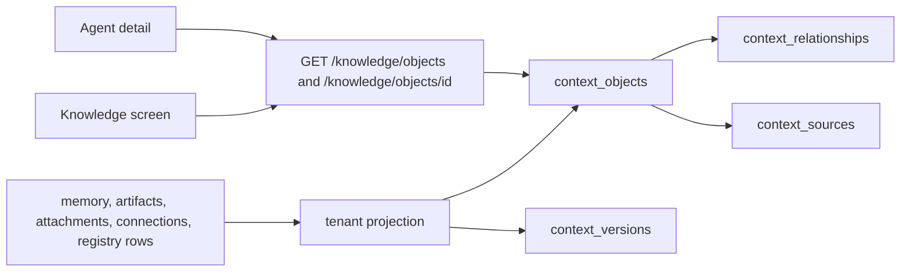

# Phase 2: Context Graph

## 1. Objective

Represent skills, tools, documents, memory, and policies as one ContextObject overlay, with immutable ContextVersions and typed ContextRelationships. The Workspace Knowledge screen and agent detail point at those objects. Native files, the capability catalogue, and connection records stay the source.

This document is the plan. It does not authorize implementation. Implementation starts only after the owner asks, and only if the KL-P1 security review is recorded and is not BLOCKED.

## 2. Relation to project end-state

KL-P2 is the universal knowledge model. KL-P3 discovers Agent Materials on top of these objects. KL-P4 writes a ContextPlan that cites these version ids. KL-P5 attaches trust and impact to a version id, not to a mutable row. Until those phases, trust, impact, cost, gaps, and context plans stay honest empty states.

The API remains the only client contract (KL-D4). Desktop and mobile keep loading `apps/web/dist`. SQLite remains the store (KL-O1, KL-D3).

## 3. Entry criteria and inherited evidence

- The owner asked to implement KL-P2 on 2026-10-06 after the KL-P1 security verdict was CONDITIONAL, not BLOCKED. Product code is in the tree. The phase is not closed until the KL-P2 security review is recorded and is not BLOCKED. KL-P3 is not started.
- KL-P1 code is in the tree: `agent_profiles`, nullable `context_plan_id` on work items, jobs, and runs, nullable `work_items.context_refs`, and `GET /agents`, `/agents/{id}`, `/knowledge/objects`, `/approvals`, `/audit`.
- KL-P1 security review is CONDITIONAL, not BLOCKED. Implementation of this plan still waits for the owner to ask. Projection must keep the post-review list rules: `preferences` and `sessions` are owner-only, and agent, approval, and audit lists require `org.admin` or both `ledger.read` and `records.read`.
- KL-P0 security remains CONDITIONAL. KL-SEC-01 and KL-SEC-02 stay open. This phase must not copy them.
- D-36, KL-D1, KL-D3, KL-D5, and KL-D8 bind this phase. KL-D2, KL-D6, and KL-D9 still apply.
- `context_plan_id` is null on existing rows. Nothing in KL-P1 writes it except the absence of a value.

## 4. Scope

- Overlay tables for ContextObject, ContextVersion, ContextRelationship, and ContextSource in the existing SQLite store.
- One typed model in the API and a matching Zod schema. Columns are the schema. A JSON blob is not a second schema.
- An idempotent projection that creates a tenant-local object for each visible memory item, loop artifact, attachment, and connection, plus a tenant-local pointer at a capability-registry row.
- Immutable versions. Supersession inserts a new version. The previous version row is not updated.
- Typed edges from the vocabulary in `docs/knowledge-layer/CANONICAL_CONCEPTS.md`.
- Knowledge list and a per-object detail that show title, kind, class, version, source, and relationships. Agent detail lists related objects. `context_plan_id` stays unset.

## 5. Non-goals

- No Papership Registry, marketplace, or catalogue rename (KL-D9).
- No Resolver, knowledge-gap detection, ContextPlan writer, or automatic attachment of context to a task.
- No trust scores, impact scores, cost figures, or chain-of-thought (KL-D7).
- No graph-drawing canvas, force layout, or node editor.
- No copy of native file bytes, skill files, MCP manifests, or Git trees into SQLite. The overlay stores a locator.
- No new grant class. No grant writes from Settings.
- No `ENGINE_USAGE_EMIT` change and no emitted reserved events.
- No Hermes write or external `accepted`. No Desktop Bridge, mobile crate, payments, or blueprint-3 chrome swap.
- No Postgres move (KL-O1). No fix of the store-wide lock or the worker path-import (KL-SEC-02). Projection must not run inside `run_engine_labs_stage_work`.
- No replacement of `GET /memory` or of `memory_ops._visible_to`. The new graph path must not call `_visible_to`.
- No deletion of Work, Inbox, People, Integrations, the founder loop, plan, measurement, or erasure intent.
- No change to `BOTTOM_TABS`.

## 6. Current-state audit

| Fact | Consequence for this phase |
|---|---|
| `memory_items` has kind, class, version, parent_id, provenance, owner, title. Body is `content` | Project metadata only. Do not put `content` on the graph list or detail |
| Loop artifacts, attachments, and connections already have tenant ids | Each becomes a source kind on a tenant-local object |
| Registry rows are the shared 43-row catalogue, not a tenant table | Store a pointer in the caller's tenant. Do not insert one global object shared across tenants |
| `GET /knowledge/objects` returns a summary list. `preferences` and `sessions` are owner-only. Agent, approval, and audit lists reject a lone `ledger.read` grant | Keep those filters on the projected list and on any new read |
| `context_plan_id` is nullable and unused | Leave it null. KL-P4 is the writer |
| Knowledge and agent screens exist on the rail | Point them at graph objects. Do not add a tab |
| Version numbers on memory can change in place today | The graph version row is the immutable copy. Do not weaken memory's existing update path in this phase |

## 7. Assumptions, constraints, risks, and decisions

Assumptions:

- A missing graph row means "not projected yet", not "the source was deleted". Projection is safe to repeat.
- One source record in one tenant maps to one ContextObject. A new memory version does not create a second object. It creates a new ContextVersion.
- Relationship endpoints both belong to the caller's tenant. A cross-tenant edge is a 404, not a filtered success.
- Hash `#knowledge/objects` stays the list. `#knowledge/<object id>` opens detail. Agent detail stays `#agents/<principal id>`.

Constraints:

- KL-D1: a ContextVersion is immutable. Its id is the SHA-256 of `tenant_id` plus the canonical metadata (object id, version number, class, source kind, source id, digest of the source metadata). Including `tenant_id` keeps the same bytes in two organisations from becoming one shared version.
- KL-D2: every insert takes `tenant_id` from the caller or from the source row that was already loaded for that caller. No new `tenant-founder`, `principal-founder`, or `proj-engine-labs` literals.
- KL-D3: pydantic models in the API are the write shape. Zod mirrors them. Do not add a JSON column that holds a second object schema.
- KL-D5: class stays `source`, `approved`, or `inferred`. Projected memory keeps its class. A registry pointer and a connection pointer start as `source`. Anything from outside the organisation starts as `inferred` and is not promoted in this phase.
- KL-D8: `locator` is a reference (memory id, artifact id, attachment id, connection id, capability id, or a path string the product already stores). It is not file contents.
- Preference-kind memory is projected only into rows the owner can list. Other callers get 403 on a direct read of that object, not a redacted body.
- List cap stays 80.

Risks:

- Projecting on every list could hold the store lock longer. Keep the projection to inserts of missing rows, and do not call Hermes.
- Updating `memory_items.version` in place would diverge from the graph. This phase does not change that memory path. The graph's own supersede route is the immutable one.
- Treating the capability catalogue as tenant data would leak or duplicate a global list. Pointers are per tenant and carry no catalogue body.

Decisions recorded here:

- KL-P2-N1. Graph data is an overlay. `memory_items` and the other sources are not replaced.
- KL-P2-N2. Version ids include the tenant so they are content-addressed inside one organisation.
- KL-P2-N3. The Workspace shows a list and a detail. It does not draw a graph.
- KL-P2-N4. Capability-registry links are tenant-local pointers. The catalogue table stays shared and unchanged.
- KL-P2-N5. This phase does not write `context_plan_id`.

## 8. Dependencies

- KL-P1 routes and nullable context columns.
- KL-P1 security review recorded and not BLOCKED, before implementation, not before this plan.
- Existing pytest, contract tests, and `apps/web` static scan.
- No new credential, DNS, or vendor account.

## 9. Architecture and affected systems

Projection runs in the API process as a short SQLite write. It does not run inside the founder-loop worker. Reads still use `AuthContext.tenant_id`.

Relationship vocabulary, and only these values: `requires`, `recommends`, `conflicts_with`, `supersedes`, `derived_from`, `validated_by`, `used_with`, `compatible_with`, `scoped_to`, `owned_by`, `published_by`, `retrieved_from`, `invalidated_by`, `improved`, `degraded`.

## 10. Files and paths in scope

- `services/api/app/knowledge_layer.py` — models, migration, projection, list, detail, supersede, relate.
- `services/api/app/store.py` — call the new migration from store init, same pattern as `migrate_workspace`.
- `services/api/app/main.py` — only if a route cannot be registered from `knowledge_layer.register_routes`.
- `services/api/tests/test_knowledge_layer.py` — extend, or add `test_context_graph.py`.
- `packages/contracts/src/entities.ts` and `src/index.ts` — schemas exported beside the KL-P1 summaries. Do not change the `ENTITY_SCHEMAS` key list that the existing test locks.
- `packages/contracts/test/knowledge-layer.test.ts` — parse the new schemas.
- `apps/web/src/api/papership.js` — fetch object detail when the hash asks for one.
- `apps/web/src/blueprint2/screens.jsx` — Knowledge list and detail; agent knowledge subsection uses graph rows.
- `apps/web/src/blueprint2/App.jsx` — hash parse for a knowledge object id. Do not change `BOTTOM_TABS`.
- Docs and state listed in section 11.

Out of scope: `services/worker/`, `apps/desktop/`, `apps/mobile/`, `packages/ui/`, Compose Postgres, Hermes env, billing.

## 11. Supporting documents to create or update

- This plan, and `docs/workstreams/20261006-knowledge-layer-p2/manifest.md` at planning time.
- At implementation: role charters and handoffs under that workstream; `docs/knowledge-layer/PHASE_ROADMAP.md` status; `docs/plans/README.md`; outstanding tasks; `.cursor/STATE.md`; the continuation log.
- `docs/knowledge-layer/CANONICAL_CONCEPTS.md` only if a seed sentence is now wrong. Do not rewrite the concept list.

## 12. Ordered implementation tasks

### T1 — Contracts

- Objective: Zod schemas for the object summary, version, relationship, and source. Version id is a 64-character hex string. Class is `source`, `approved`, or `inferred`. Relationship is the closed vocabulary.
- Dependencies: none.
- Files: `packages/contracts/src/entities.ts`, `index.ts`, `test/knowledge-layer.test.ts`.
- Notes: summaries omit `content`, file bytes, and chain-of-thought.
- Validation: `npm test` in `packages/contracts`.
- Completion: not started.

### T2 — Store overlay

- Objective: create the four tables and an update trigger that rejects changes to `context_versions`.
- Dependencies: T1 shapes.
- Files: `services/api/app/knowledge_layer.py`, `store.py` init.
- Notes: follow the existing `PRAGMA table_info` plus `CREATE TABLE IF NOT EXISTS` style. No foreign-key requirement beyond what SQLite already has enabled. Columns are nullable only where the plan says so (`owner_principal_id`, `parent_version_id`, `from_version_id`, `to_version_id`).
- Validation: pytest opens a fresh store and a store created before the columns exist; version update raises.
- Completion: not started.

### T3 — Projection and reads

- Objective: `ensure_projected(tenant_id, caller_id)` inserts missing objects and version 1. `GET /knowledge/objects` returns the projected summaries. `GET /knowledge/objects/{id}` returns the object, its versions, its relationships, and its source locator. Missing grant is 403. Another tenant's id is 404.
- Dependencies: T2.
- Files: `knowledge_layer.py`.
- Notes: do not call `_visible_to` or `maybe_emit`. Preference objects are listed and readable only by `owner_principal_id`. Registry projection inserts a pointer whose `source_id` is the capability id and whose title is the capability id, not a copied catalogue payload. Do not write `context_plan_id`.
- Validation: founder sees `mem-1` projected; `principal-other` with `org.admin` does not; hidden preference is absent; response text has no memory body.
- Completion: not started.

### T4 — Supersede and relate

- Objective: `POST /knowledge/objects/{id}/versions` inserts the next version and leaves the previous row byte-for-byte. `POST /knowledge/relationships` creates one edge in the caller's tenant. Both require `memory.write` or `org.admin`. Class on a new external version stays `inferred` unless the caller passes `approved` and has `memory.write`. This phase does not auto-approve.
- Dependencies: T3. Security review of the T2–T3 diff before this is called done.
- Files: `knowledge_layer.py`, tests.
- Notes: reject a relationship type outside the vocabulary with 400. Reject a cross-tenant target with 404.
- Validation: version 1 digest unchanged after version 2; audit of the version table shows no update.
- Completion: not started.

### T5 — Workspace

- Objective: Knowledge list shows projected rows. Object detail shows versions and relationships as text, with an empty state when there are no edges. Agent detail "Knowledge" lists objects tied to that principal by `owned_by` or by memory ownership. Context line stays "No context plan". Trust, impact, cost, and missing stay "Unavailable until a later phase".
- Dependencies: T3. T4 can land in parallel if the detail tolerates an empty edge list.
- Files: `papership.js`, `App.jsx`, `screens.jsx`.
- Notes: failed fetch is an error string, not the old fixture deck. Do not paint a graph. Bottom tabs stay.
- Validation: browser at desktop width and under 768px; static scan.
- Completion: not started.

### T6 — Gates

- Objective: security review of the full diff, then project-lead reconciliation. Stop if the verdict is BLOCKED.
- Dependencies: T1–T5.
- Files: workstream role folders only.
- Validation: handoffs on disk, verdict not BLOCKED.
- Completion: not started.

## 13. Adaptive role and delegation map

Risk tier for implementation: Tier 3. New tenant-scoped knowledge rows and version immutability. Planning does not start these roles.

| Role ID | Required or skipped | Reason | Predecessor | Owned paths | Gate evidence | Status |
|---|---|---|---|---|---|---|
| product-manager-subagent | skipped | D-36, the canonical concepts, and the KL-P1 next-plan prompt already fix this scope. No release or price change | — | — | manifest | skipped |
| ui-ux-developer-subagent | required at implementation | List, detail, empty edges, and the agent subsection are user-visible. No new navigation model | this plan | `apps/web/src/blueprint2/` | `ui-ux-developer-subagent/handoff.md` | not started |
| software-engineer-subagent | required at implementation | Schema, projection, routes, contracts, UI | UI charter before T5; T1–T4 may start with the charter | section 10 | `software-engineer-subagent/handoff.md` | not started |
| security-engineer-subagent | required at implementation | Tenant isolation, immutable versions, untrusted class, no body in payloads | T3 diff, then full diff at T6 | read-only on product; writes the role folder | `security-engineer-subagent/handoff.md` | not started |
| growth-marketing-subagent | skipped | No events emitted. Charges and usage flag stay as they are | — | — | manifest | skipped |
| project-lead-subagent | required at implementation | Reconcile gates before any KL-P3 plan | security T6 handoff | `delivery/owner-handoff.md` | owner handoff | not started |

Charters are written at implementation start under `docs/workstreams/20261006-knowledge-layer-p2/<role-id>/`. They are not written in this planning turn.

## 14. Test and validation matrix

| Requirement | Validation method | Expected evidence | Status |
|---|---|---|---|
| Overlay tables and immutable versions | pytest | update of `context_versions` fails; version 1 unchanged after supersede | not started |
| Tenant isolation | pytest | other tenant cannot read or relate to founder objects | not started |
| Preference owner-only | pytest | hidden preference absent from list and direct read | not started |
| No memory body | pytest | response has no `content` and no seeded secret string | not started |
| Registry pointer is tenant-local | pytest | two tenants can each have a pointer; catalogue row count stays 43 | not started |
| Class stays untrusted for outside input | pytest | new external version remains `inferred` without an explicit approve | not started |
| No founder literals, no emit, no `_visible_to` | source assertion | `knowledge_layer.py` graph functions | not started |
| `context_plan_id` still null | pytest | projection and supersede do not set it | not started |
| Bottom tabs | static scan | `BOTTOM_TABS` still `today`, `work`, `inbox` | not started |
| Browser | desktop and under 768px | Knowledge list, object detail, agent knowledge line, empty relationships | not started |
| Security gate | handoff | not BLOCKED | not started |

## 15. Security, privacy, reliability, accessibility, and performance checks

- Security and privacy: tenant from the caller; 403 for a missing grant; 404 for another tenant's id; preferences and sessions stay owner-only; a lone `ledger.read` grant cannot list agents, approvals, or audit; version rows are insert-only; third-party class stays `inferred`; locators are ids, not file bytes; no secrets in responses.
- Reliability: projection is idempotent and stays out of `run_engine_labs_stage_work`. A failed projection does not delete the source row.
- Accessibility: detail is a definition list or the existing labelled rows. Edges are text, so they remain available without a canvas. Keyboard reachability is part of the browser pass.
- Performance: project only missing rows; list cap 80; do not hold the store lock across a Hermes call.

## 16. Environment-variable registry

No new variables. Names that stay in force:

| Variable name | Purpose | Scope/environment | Required by phase | Source/provider | Status |
|---|---|---|---|---|---|
| ENGINE_STORE_PATH | SQLite file | API | unchanged | local or host | existing, value not recorded |
| SUPABASE_JWT_SECRET | HMAC secret name | API | unchanged | operator secret store | existing, value not recorded |
| ENGINE_JWT_ISSUER | Token issuer | API | unchanged | existing | existing |
| ENGINE_JWT_AUDIENCE | Token audience | API | unchanged | existing | existing |
| ENGINE_TEST_HOOKS | Local session mint | API test and local | unchanged | existing | existing |
| ENGINE_USAGE_EMIT | Usage emission | API | must stay off | existing | unchanged |
| ENGINE_BILLING_CHARGES_ENABLED | Charges | API | must stay off | existing | unchanged |

## 17. Deferred human-action queue

| Action | Why agent cannot perform it | Earliest required phase | Blocking now? | Final-checklist destination |
|---|---|---|---|---|
| KL-P1 security review verdict | Independent review already requested; this plan does not invent the verdict | before KL-P2 implementation | yes for implementation, no for this plan | OT-75 |
| Owner asks to implement KL-P2 | Scope start | KL-P2 | no | this plan section 1 |
| Postgres decision | KL-O1 | before KL-P4 | no | final checklist when that phase exists |
| papership.com.au | KL-P7 | KL-P7 | no | final checklist |

## 18. Rollback and recovery

The overlay tables are additive. Rollback is to stop calling projection and hide the object detail route. Do not drop `memory_items` or the KL-P1 columns. Version rows that were inserted can remain; they are not authoritative for the product until the Knowledge screen reads them. There is no data migration from Postgres.

## 19. Acceptance criteria

- A memory item, an artifact, an attachment, a connection, and a capability id can each appear as a ContextObject in the caller's tenant without replacing the native record.
- Two versions of one object can exist. The older version row is unchanged.
- A relationship uses only the published vocabulary and cannot cross tenants.
- The Knowledge screen and agent detail show graph summaries. They do not show a canvas, a context plan, or trust, impact, or cost numbers.
- Security review of the implementation is not BLOCKED.
- KL-P3 is not started.

## 20. Completion evidence

- Overlay tables, projection, supersede, and relationships are in `services/api/app/knowledge_layer.py`.
- Pytest `tests/test_knowledge_layer.py` and `tests/test_context_graph.py`: 4 passed. Contracts 16 passed. Web static scan 15 passed.
- Browser checked the Knowledge list and an object detail at 1280 px and 390 px.
- Security handoff PASS: `docs/workstreams/20261006-knowledge-layer-p2/security-engineer-subagent/handoff.md`.
- Project lead handoff PASS: `docs/workstreams/20261006-knowledge-layer-p2/project-lead-subagent/handoff.md`.
- Not committed. KL-P3 plan is drafted and not implemented.

## 21. Deviations and follow-ups

- KL-P1's next-plan prompt said to confirm the security verdict first. The owner asked for this plan while that review was still running. The plan records the stop. It does not treat the review as passed.
- `memory_items` can still change a version in place. Closing that gap is not this phase unless the security review of KL-P2 requires the graph path to be the only version writer. Default: leave the memory update path alone.
- KL-SEC-01 and KL-SEC-02 remain follow-ups. They are not fixed here.

## 22. Next Plan Generation Prompt

Read `/AGENTS.md`, the complete core agent context, `/instructions/PROJECT_PLANNING.md`, `/instructions/ROLES.md`, `docs/decisions/2026-10-06-knowledge-layer-mission.md`, `docs/knowledge-layer/PHASE_ROADMAP.md`, `docs/knowledge-layer/DECISION_LOG.md`, `docs/knowledge-layer/CANONICAL_CONCEPTS.md`, this completed phase plan, `docs/workstreams/20261006-knowledge-layer-p2/manifest.md`, and every required role handoff. Confirm KL-P2 acceptance criteria are met and the security verdict is not BLOCKED. Then generate exactly one plan at `docs/plans/knowledge-layer/phase_3_federated_registry_plan.md`.

That plan is discovery of Agent Materials. It honours KL-D9: the capability catalogue stays named as the capability registry, and the Papership Registry is the new discovery surface. Native sources stay canonical (KL-D8). It does not build the Resolver, trust scores, or a marketplace. Include every section of `.cursor/templates/phase-plan-template.md`. Do not implement KL-P3 until that plan is written and the owner asks.
